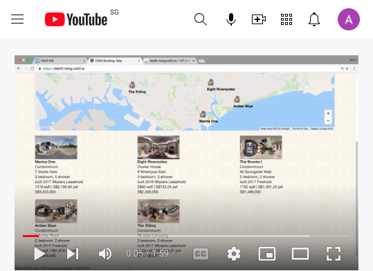

#### CS50 - 2016
# C programming, & introduction to computer science
Topics include abstraction, algorithms, data structures, encapsulation, resource management, security, 
software engineering, and web development. Languages include C, Php, SQL, and JavaScript plus CSS and HTML. 
Problem sets inspired by real-world domains of biology, cryptography, finance, forensics, and gaming.  

---

**C**  programming exercises
* pset1 - water.c, greedy.c,  [mario.c](pset1/hacker/mario.c)
  ``` console
  ./mario
  height: 4
     #  #
    ##  ##
   ###  ###
  ####  ####
  ```
* pset2 - initial.c, caesar.c,  [vigenere.c](/pset2/vigenere.c), crack.c
  ``` console
  ./vigenere bacon
  Meet me at the park at eleven am
  Negh zf av huf pcfx bt gzrwep oz
  ```
* pset3 - fifteen, [hackerfind/helpers.c](/pset3/hackerfind/helpers.c)
  ``` c
  void merge (int array[], int start, int LeftHi, int RightLo, int RightHi)
  {
      int LeftLo = start;
      int tindex = 0;
      int tmp[RightHi - start];

      if (array == NULL) { return;}

      while ( (LeftLo <= LeftHi) || (RightLo <= RightHi) )
      {
  ```
* pset4 - copy.c,  [resize.c](/pset4/bmp/resize.c),  whodunit.c,  recover.c
  ``` console
  antw@Mac-mini c % xxd -c 12 -g 3 -s 54 small.bmp
  0000036: 00ff00 00ff00 00ff00 000000  ............
  0000042: 00ff00 ffffff 00ff00 000000  ............
  000004e: 00ff00 00ff00 00ff00 000000  ............
  antw@Mac-mini c % ./resize 4 small.bmp large.bmp
  antw@Mac-mini c % ls *.bmp                      
  large.bmp	small.bmp
  ```
* pset5 - dictionary.c
  ``` console
  ./speller texts/holmes.txt
  ...
  WORDS MISSPELLED:     17845
  WORDS IN DICTIONARY:  143091
  WORDS IN TEXT:        1150970
  TIME IN load:         0.03
  TIME IN check:        0.96
  TIME IN size:         0.00
  TIME IN unload:       0.02
  TIME IN TOTAL:        1.02
  ```
* pset6 - server.c
  ``` console
  ~/workspace/pset6 $ ./server public
  Using /home/ubuntu/workspace/pset6/public for server's root
  Listening on port 8080
  GET / HTTP/1.1
  HTTP/1.1 200 OK
  GET /cat.jpg HTTP/1.1
  HTTP/1.1 200 OK
  ```
* pset7 - pset7.sql,  [index.php](/pset7/public/index.php),  login.php,  sell.php, buy.php,  setpassword.php 
  ``` php
    foreach ($rows as $row)
    {   $stock = lookup($row["symbol"]);
        if ($stock !== false)
        {   $positions[] = [
                "name" => $stock["name"],
                "price" => $stock["price"],
                "shares" => (number_format($row["shares"], 0, '.', ',')),
                "symbol" => $row["symbol"],
  ```
* pset8 - [scripts.js](/pset8/public/js/scripts.js), pset8.sql,  index.html, search.php, article.php
  ``` js
  var map;
  var markers = [];
  var info = new google.maps.InfoWindow();
  var country = "us"; //

  $(function() {
      var styles = [
          {
              featureType: "all",
              elementType: "labels",
  ```
* psexec - project, title: CS50 Property

  [](https://youtu.be/fRVdOQHeC7Q)
  
---
### Python3
* [conversion to Python summary](https://github.com/alvintwng/cs50-2019)

* [`Python3` and `C` differences](https://github.com/alvintwng/cs50-2019/blob/master/cs50%202019%20my%20python.md)

* [mario, credit, crack ...](https://github.com/alvintwng/cs50-2019/blob/master/pset6_%20hello_mario_credit_crack_caesar_vigenere_bleep.py)

---
